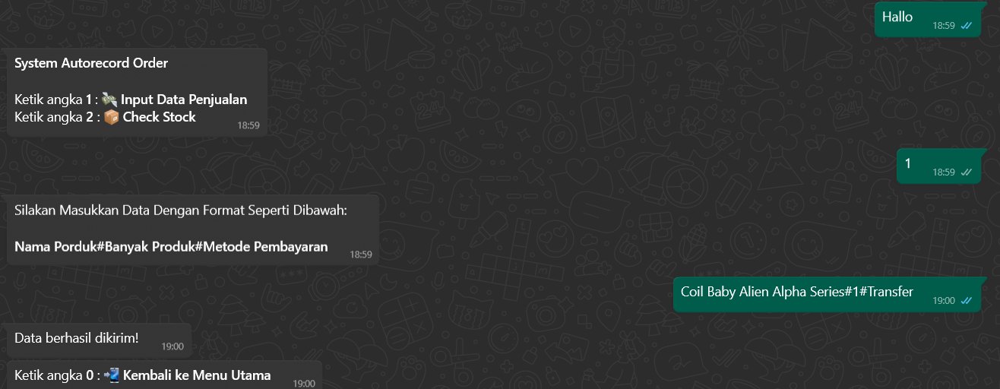
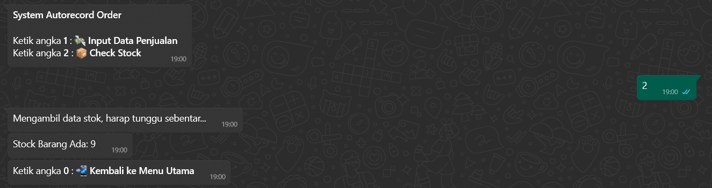
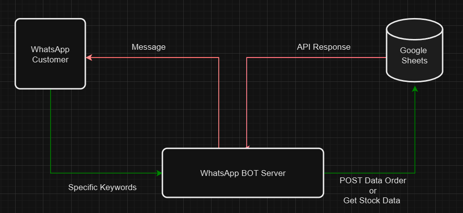

# WhatsApp BOT For Record Order Selling




## BOT Workflow

<P style="margin-top:8px" >The image above illustrates the workflow of the WhatsApp bot. It shows how a customer sends a keyword to the bot, the server forwards the request to the GSheet API, and the bot responds back to the customer's WhatsApp number.</P>


## How To Install
  1. **Create .env File**
     ```sh
     cp .env.example .env
     ```

  2. **Install Dependencies**
     ```sh
     npm install
     ```

  3. **Run the Bot**
     ```sh
     npm run dev
     ```
